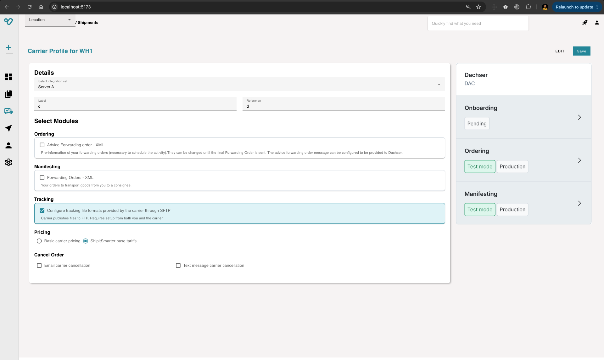

# Shipit Smarter project 

## Using Vue 3 + TypeScript + Vite

## Project Structure

     src/
        components/
            1.  AppBar.vue
                AppBar.spec.ts 

            2.  NavigationDrawer.vue
                NavigationDrawer.spec.ts
            
            3.  CarrierProfile.vue
                CarrierProfile.spec.ts

        stores/
            1.  carrierProfileStore.ts
                carrierProfileStore.spec.ts 

        data/
            1.  mockCarrierProfileData.js

        App.vue

# Setup
    npm Install

# Start
    npm run dev

# Unit tests
    npm run test:unit
                
            
                
